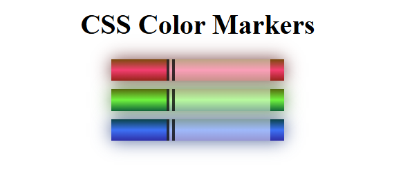

# css-colors

Projeto desenvolvido no âmbito do meu estágio na Visabeira com o objetivo de praticar a utilização de **CSS** para criar gradientes, sombras e efeitos visuais.

## 🧠 Objetivo

Recriar marcadores coloridos utilizando apenas **HTML** e **CSS**, explorando conceitos de gradientes lineares, sombras e manipulação de cores em diferentes formatos (RGB, HSL e HEX).  
Este projeto permitiu-me consolidar noções de estilização e design com CSS.

## ⚙️ Tecnologias utilizadas

- HTML5  
- CSS3 (gradients, box-shadow, inline-block)

## 📸 Demonstração



## 🚀 Como executar

1. Clonar o repositório principal:

   ```bash
   git clone https://github.com/SofiaAlCosta/Internship-Visabeira
    ```

2. Navegar até à pasta do projeto:

    ```bash
   cd css-colors
    ```

3. Abrir o ficheiro index.html num navegador web.