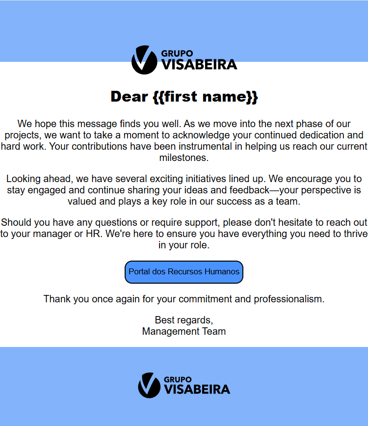

# email-template-visabeira

Este projeto é um template de email HTML desenvolvido no âmbito do meu estágio na Visabeira.  
Foi criado com o objetivo de servir como base para comunicações internas formais, com foco em clareza, branding e compatibilidade com clientes de email.

## 🧠 Objetivo

Estruturar um layout de email responsivo e visualmente alinhado com a identidade da empresa, incluindo:
- Cabeçalho com logótipo
- Corpo com mensagem personalizada
- Chamada para ação (botão para o Portal RH)
- Rodapé institucional

## ⚙️ Tecnologias utilizadas

- HTML (com estrutura de tabelas, para compatibilidade em clientes de email)
- Inline CSS
- Branding oficial Visabeira

## 🖼️ Captura de ecrã

## 🚀 Como visualizar

1. Navegar até à pasta `email-template-visabeira`.
2. Abrir o ficheiro `index.html` num navegador.
3. (Opcional) Copiar o conteúdo HTML para plataformas de envio de email (ex: Mailchimp, Outlook, etc.).