# flask-apple-store

Este projeto foi desenvolvido no âmbito do meu estágio na Visabeira, com o objetivo de criar uma loja online inspirada na Apple Store, utilizando **Flask** como framework backend.

## 🧠 Objetivo

Desenvolver uma aplicação web funcional com funcionalidades completas de e-commerce, incluindo:

- Página principal com produtos e destaques
- Página de detalhe de produto com sistema de reviews
- Gestão de perfil do utilizador
- Favoritos e carrinho de compras
- Processo de checkout e confirmação de encomenda
- Registo e autenticação de utilizadores

O projeto permitiu-me praticar conceitos de **desenvolvimento web full stack**, com foco especial em **Flask**, **templates Jinja2**, **rotas**, e gestão de **estado do utilizador**.

## ⚙️ Tecnologias utilizadas

- Python (Flask)
- HTML5 + Jinja2
- CSS3
- JavaScript (mínimo)
- SQLite (para armazenamento de dados)
- Bootstrap (estilização básica)
- Pillow (para imagens)

## 📸 Demonstração

### 🏠 Página principal (homepage)

**Topo:**
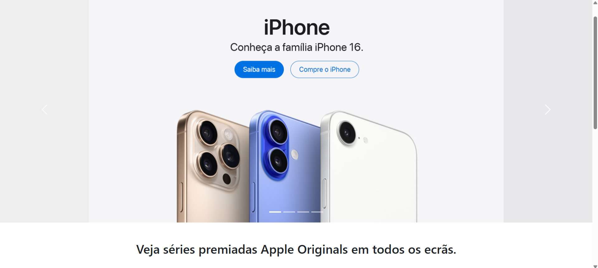

**Fundo:**


### 🛍️ Página de Produto

**Topo:**
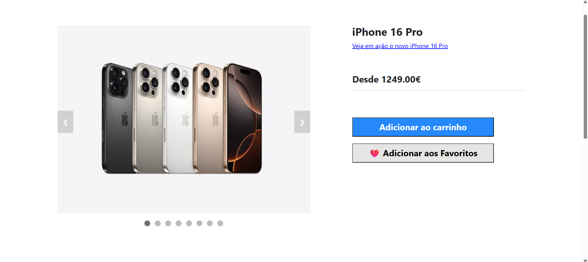

**Fundo:**
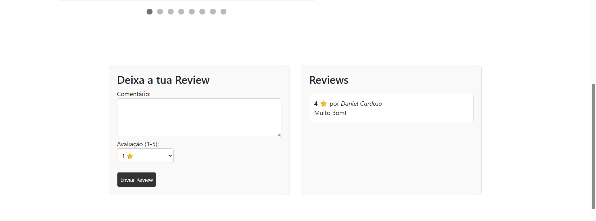

### 🙍 Página de Perfil

**Topo:**
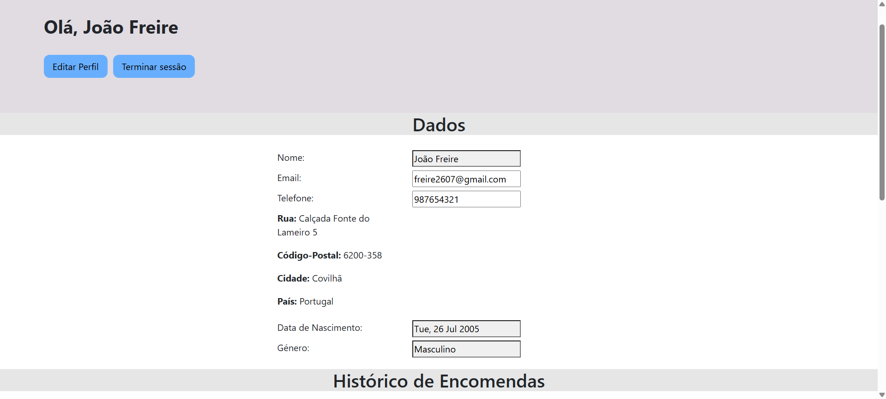

**Fundo:**
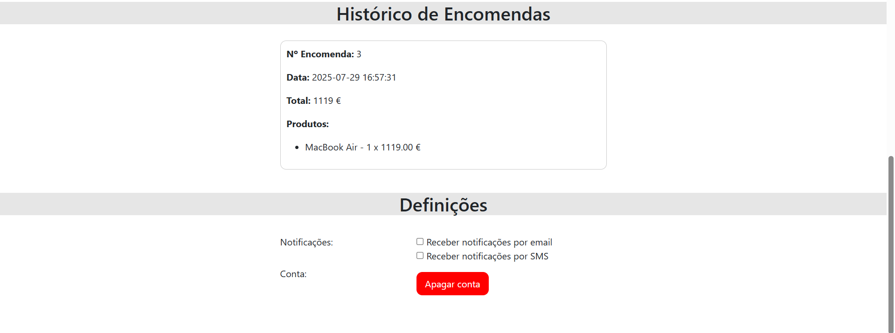

### ❤️ Favoritos


### 🛒 Carrinho

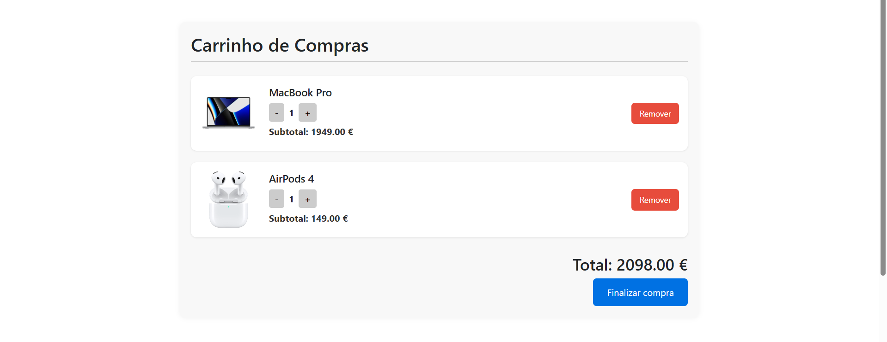

### ✅ Checkout

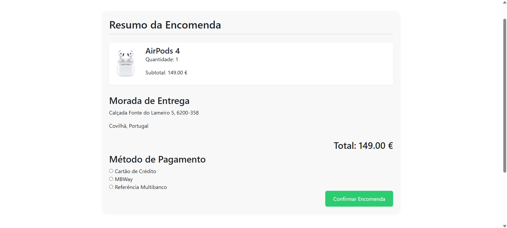

### 🔐 Autenticação

**Login:**
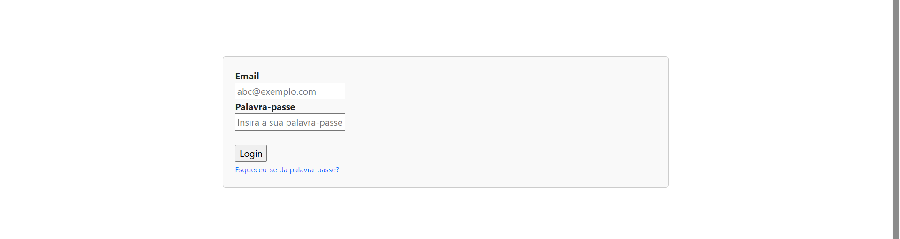

**Registo:**
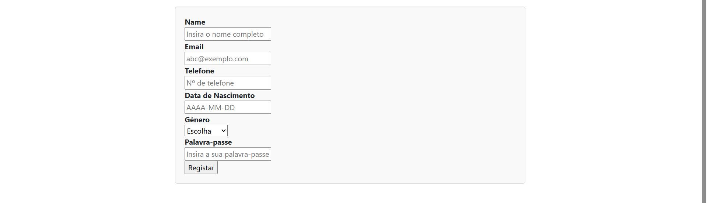

### 📦 Encomenda Confirmada


### 🔻 Header e Footer

**Header:**
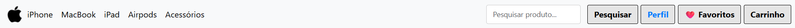

**Footer:**
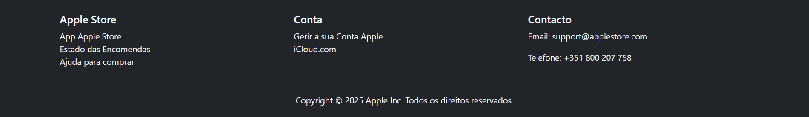

## 🚀 Como executar

1. Clonar o repositório:

   ```bash
   git clone https://github.com/SofiaAlCosta/Internship-Visabeira
   ```

2. Aceder à pasta do projeto:

   ```bash
   cd flask-apple-store
   ```

3. Instalar as dependências necessárias:

   ```bash
   pip install -r requirements.txt
   ```

4. Executar a aplicação Flask:

   ```bash
   python store.py
   ```

5. Abrir o navegador e aceder a:

   ```
   http://127.0.0.1:5000
   ```
