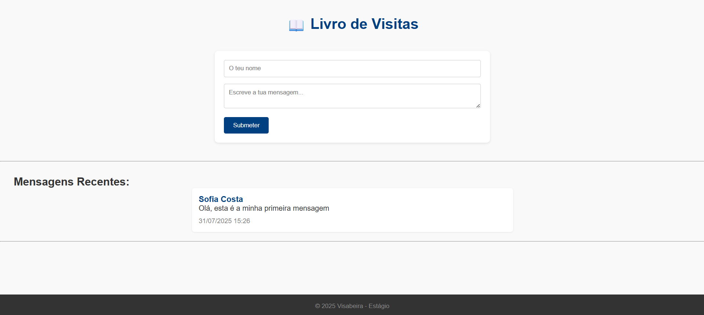
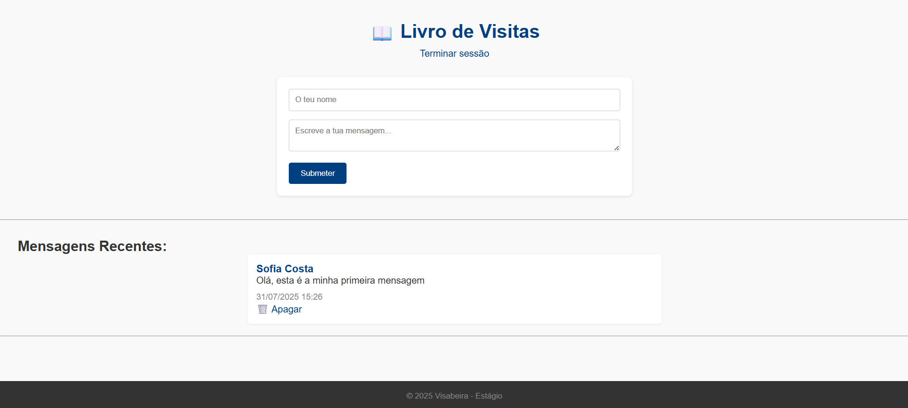

# guestbook-visabeira

Projeto desenvolvido no âmbito do meu estágio na Visabeira com o objetivo de criar um pequeno sistema de livro de visitas online.

## 🧠 Objetivo

Permitir que visitantes deixem mensagens públicas através de um formulário, que ficam visíveis na mesma página.  
O sistema inclui ainda uma área de administração onde é possível apagar mensagens indesejadas através de autenticação simples.

Este projeto permitiu-me consolidar conceitos essenciais de **PHP**, **bases de dados MySQL**, **manipulação de formulários** e **controlo de sessões**, além de boas práticas de estruturação de ficheiros reutilizáveis.

## ⚙️ Tecnologias utilizadas

- PHP
- HTML5
- CSS3
- JavaScript (mínimo)
- MySQL (XAMPP)
- Flexbox (layout responsivo)

## 📸 Demonstração

### 📝 Formulário de mensagem e 💬 Mensagens



### 🔐 Login de admin


### 🗑️ Modo admin com botão de apagar



## 🚀 Como executar

1. Clonar o repositório principal:

    ```bash
    git clone https://github.com/SofiaAlCosta/Internship-Visabeira
    ```

2. Navegar até à pasta do projeto:

    ```bash
    cd Internship-Visabeira/guestbook-visabeira
    ```

3. Importar o ficheiro guestbook.sql para o MySQL através do phpMyAdmin ou MySQL Workbench.
4. Abrir o projeto com o XAMPP (ou outro servidor local PHP) e aceder a:

    ```bash
    http://localhost/guestbook-visabeira
    ```

5. Aceder à área de administração:

    ```bash
    http://localhost/guestbook-visabeira/admin/login.php
    ```
## 🔐 Credenciais padrão

**Utilizador:** `admin`  
**Palavra-passe:** `1234`