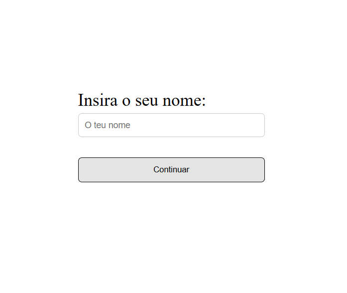
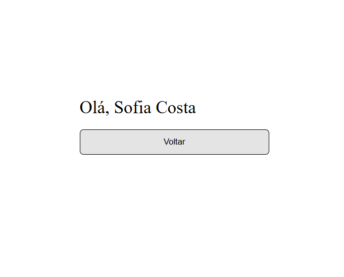

# js-name-alert

Este é um projeto introdutório desenvolvido no âmbito do meu estágio na Visabeira, com o objetivo de praticar a utilização básica de **JavaScript**, **HTML** e **CSS**.

## 🧠 Objetivo

Criar uma pequena interface onde o utilizador insere o seu nome e recebe uma saudação personalizada. Se o campo for deixado em branco, é apresentado um alerta a indicar que o nome deve ser preenchido.

Este projeto permitiu-me explorar os conceitos fundamentais de manipulação do DOM e interatividade com o utilizador em JavaScript.

## ⚙️ Tecnologias utilizadas

- HTML
- CSS
- JavaScript (vanilla)

## 📸 Demonstração

### Antes de inserir o nome:



### Após inserir o nome e clicar em "Continuar":



## 🚀 Como executar

1. Clonar o repositório principal:

   ```bash
   git clone https://github.com/seu-utilizador/js-name-alert.git
   ```

2. Navegar até à pasta do projeto:

   ```bash
   cd js-name-alert
   ```

3. Abrir o ficheiro `index.html` num navegador web.
