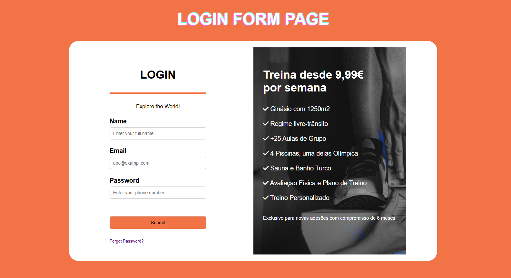

# login-form-gym

Projeto desenvolvido no âmbito do meu estágio na Visabeira com o objetivo de praticar a criação de layouts com **containers flexíveis (Flexbox)** em CSS.

## 🧠 Objetivo

Desenvolver uma página de login visualmente apelativa e responsiva, aplicando conceitos de **layout com Flexbox**, separação de conteúdo em colunas e estilização com CSS. O projeto simula uma interface de acesso a uma plataforma de ginásio, com destaque para as funcionalidades e ofertas do serviço.

## ⚙️ Tecnologias utilizadas

- HTML5
- CSS3 (Flexbox)
- Font Awesome (ícones via CDN)

## 📸 Demonstração



## 🚀 Como executar

1. Clonar o repositório principal:

   ```bash
   git clone https://github.com/SofiaAlCosta/Internship-Visabeira
   ```

2. Navegar até à pasta do projeto:

   ```bash
   cd login-form-gym
   ```

3. Abrir o ficheiro `index.html` num navegador web.
