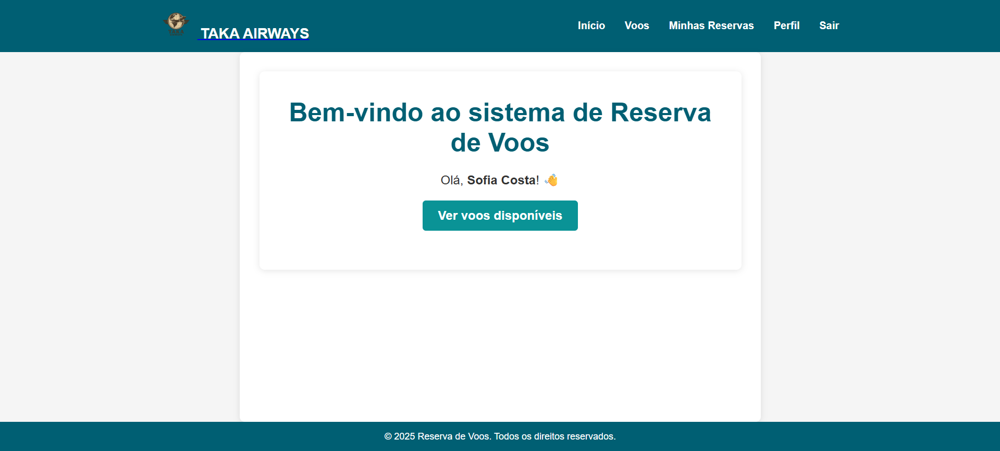
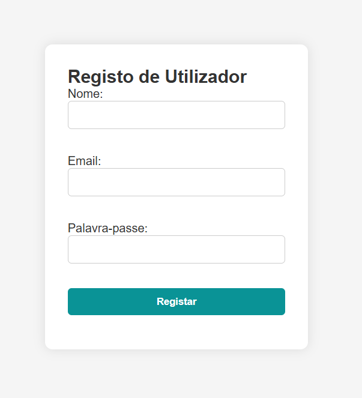
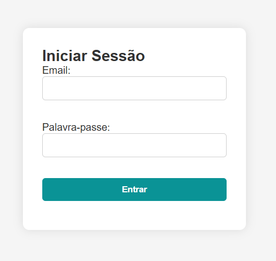
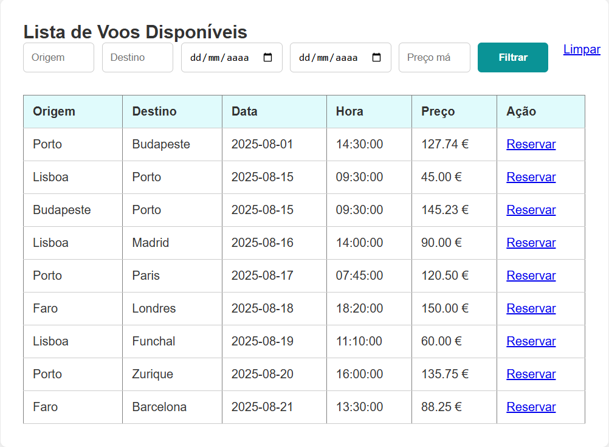
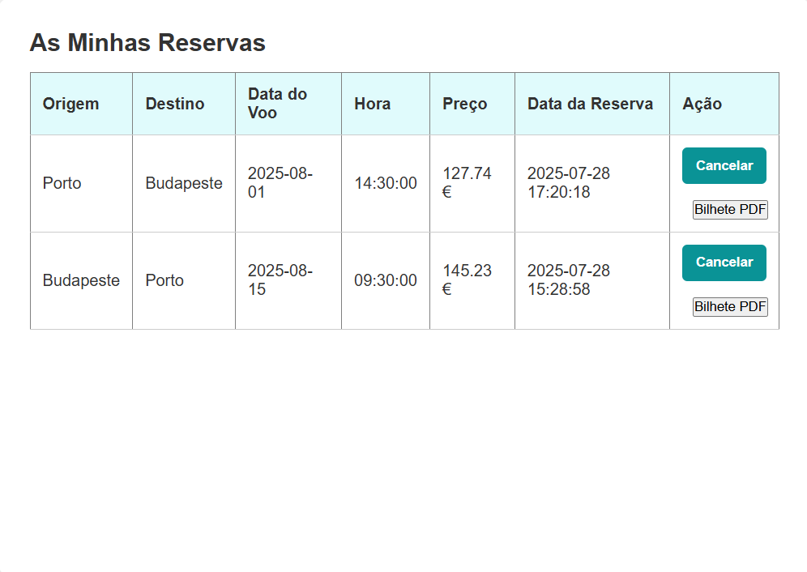
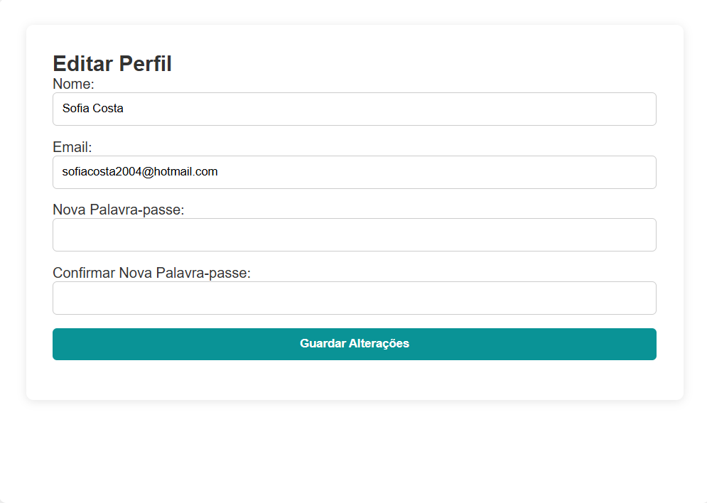
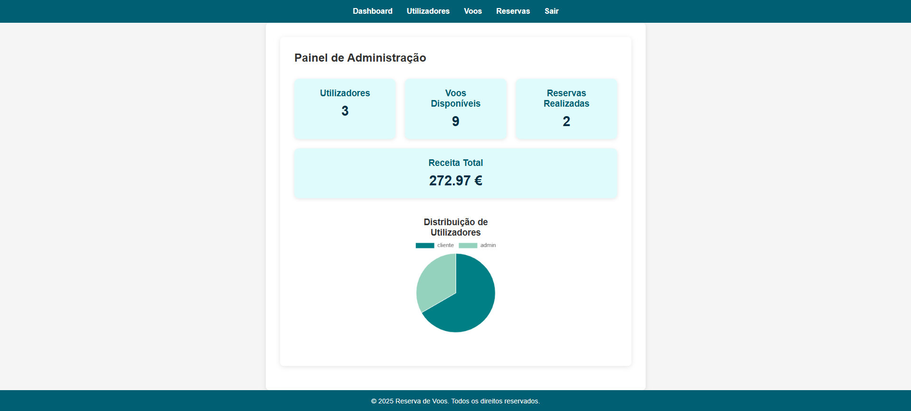
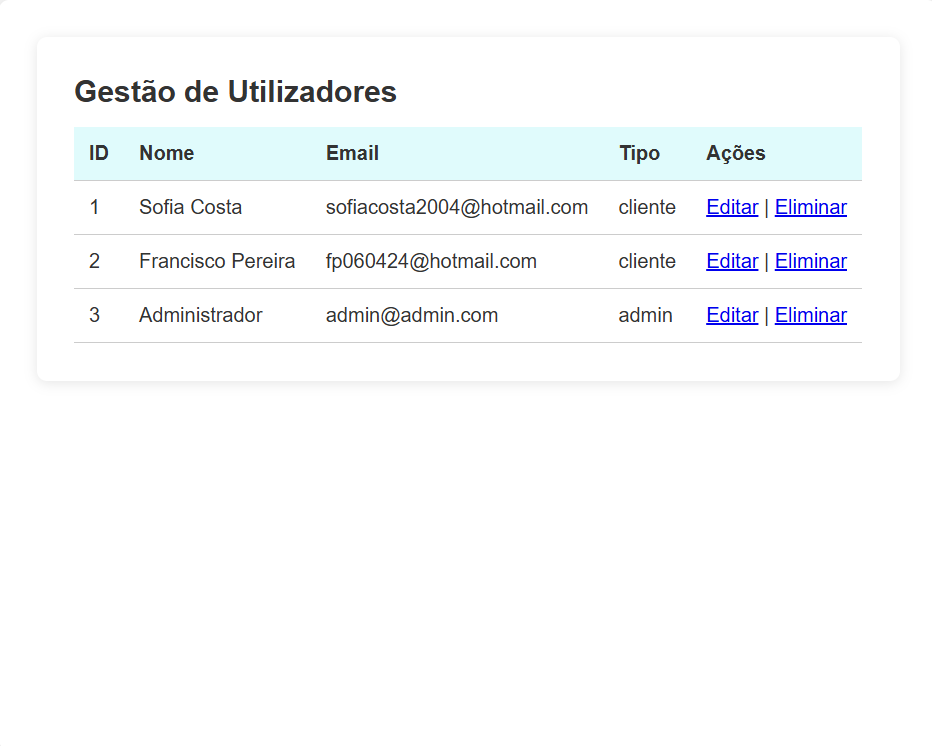
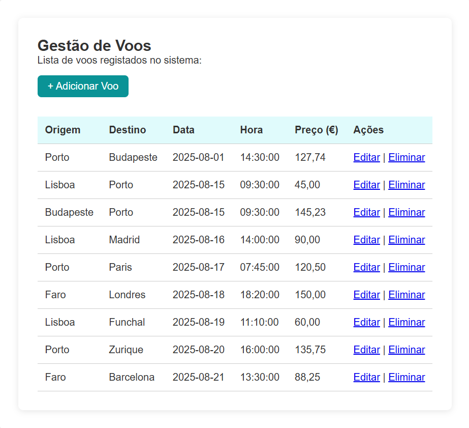
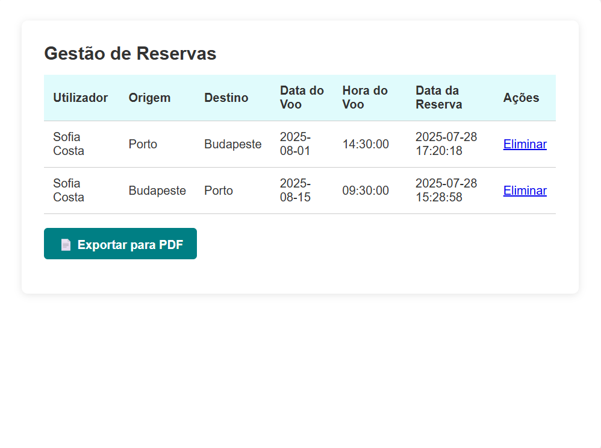

# ✈️ Taka Airways - Sistema de Reserva de Voos

Sistema web de gestão de reservas de voos com diferentes funcionalidades para clientes e administradores.

## 📸 Demonstração

### Página Inicial


### Autenticação
- **Registo**  
  
- **Login**  
  

### Cliente

- **Visualizar Voos Disponíveis**  
  

- **Minhas Reservas**  
  

- **Editar Perfil**  
  

### Administrador

- **Dashboard**  
  

- **Gestão de Utilizadores**  
  

- **Gestão de Voos**  
  

- **Gestão de Reservas**  
  

---

## 🚀 Como executar

1. Clonar o repositório:

   ```bash
   git clone https://github.com/seu-utilizador/taka-airways-system.git
   ```

2. Aceder à pasta do projeto:

   ```bash
   cd taka-airways-system
   ```

3. Colocar o projeto num servidor com suporte PHP (ex: XAMPP, WAMP ou Laragon).
4. Aceder via navegador a:

   ```bash
   http://localhost:8080/taka-airways-system/index.php
   ```
