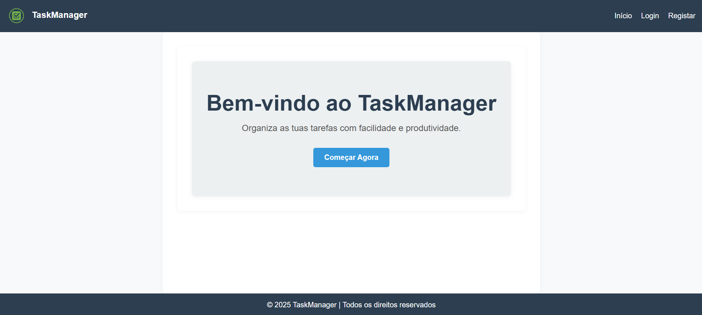
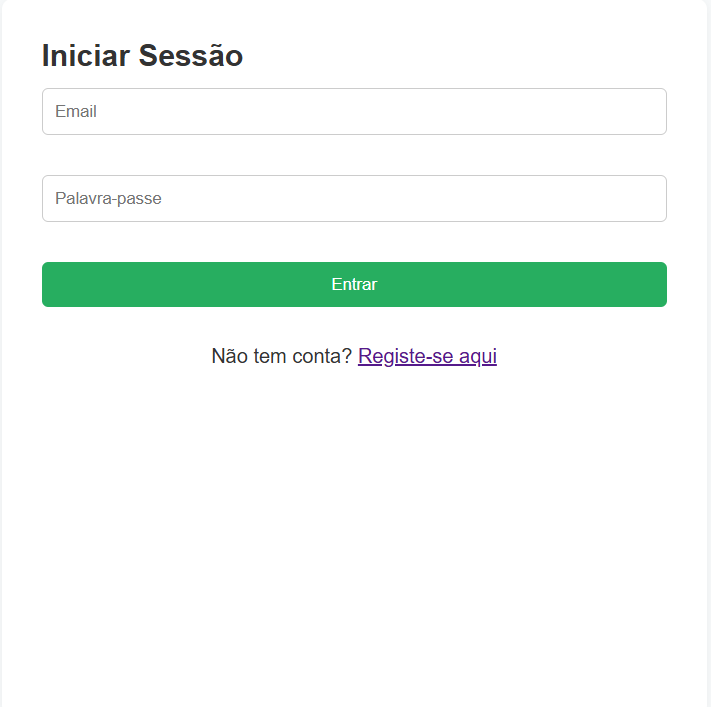
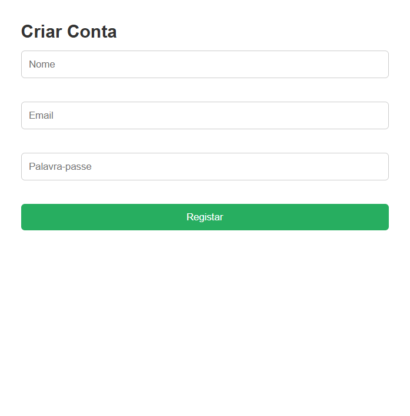
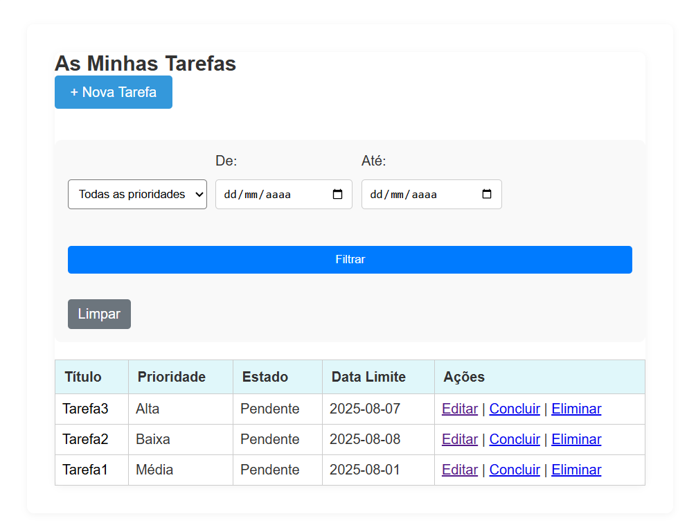
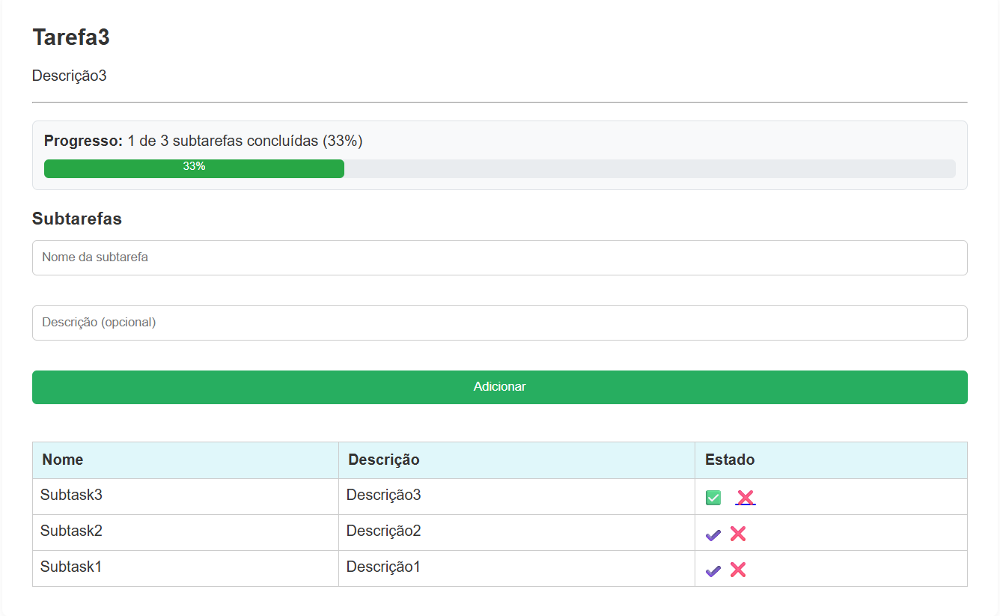
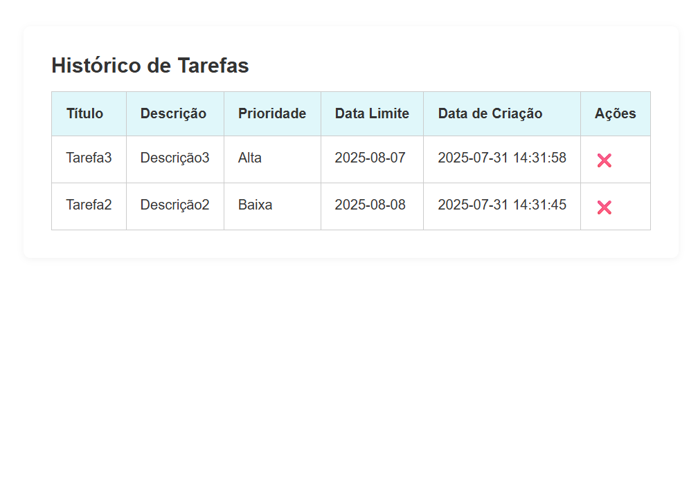
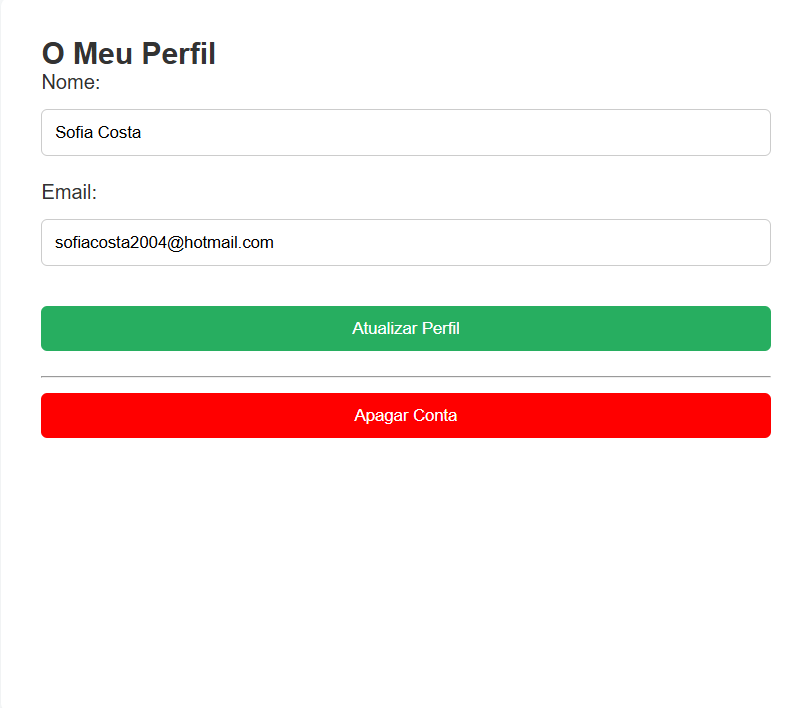

# task-manager-system

Projeto desenvolvido no âmbito do meu estágio na Visabeira com o objetivo de criar um sistema web para gestão de tarefas pessoais.

## 🧠 Objetivo

Desenvolver uma aplicação que permita aos utilizadores gerir as suas tarefas de forma prática e organizada, com funcionalidades como:

- Registo e autenticação de utilizadores
- Criação, edição, eliminação e conclusão de tarefas
- Gestão de subtarefas
- Filtros por prioridade e estado
- Histórico de tarefas concluídas
- Edição de perfil e eliminação de conta

Este projeto permitiu-me consolidar conhecimentos em **PHP**, **gestão de sessões**, **consultas SQL dinâmicas** e estruturação modular com includes.

## ⚙️ Tecnologias utilizadas

- PHP
- HTML5
- CSS3
- JavaScript
- MySQL
- Bootstrap (parcial)
- Font Awesome (ícones via CDN)

## 📸 Demonstração

### 🏠 Página Inicial


### 🔐 Autenticação



### ✅ Gestão de Tarefas




### 🙍 Gestão de Conta


## 🚀 Como executar

1. Clonar o repositório:

   ```bash
   git clone https://github.com/SofiaAlCosta/Internship-Visabeira
   ```

2. Aceder à pasta do projeto:

   ```bash
   cd task-manager-system
   ```

3. Colocar o projeto num servidor com suporte PHP (ex: XAMPP, WAMP ou Laragon).
4. Aceder via navegador a:

   ```bash
   http://localhost:8080/taka-airways-system/index.php
   ```